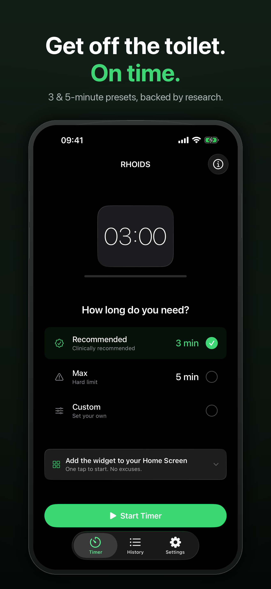
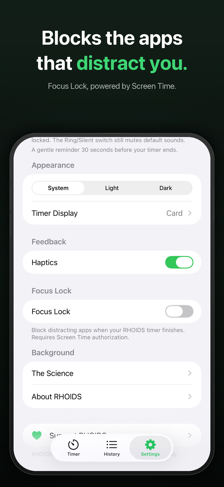
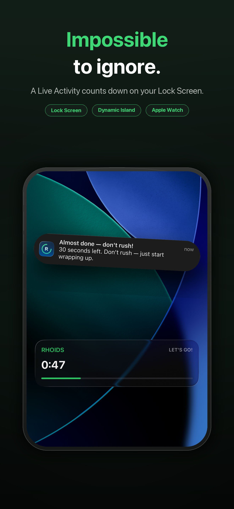
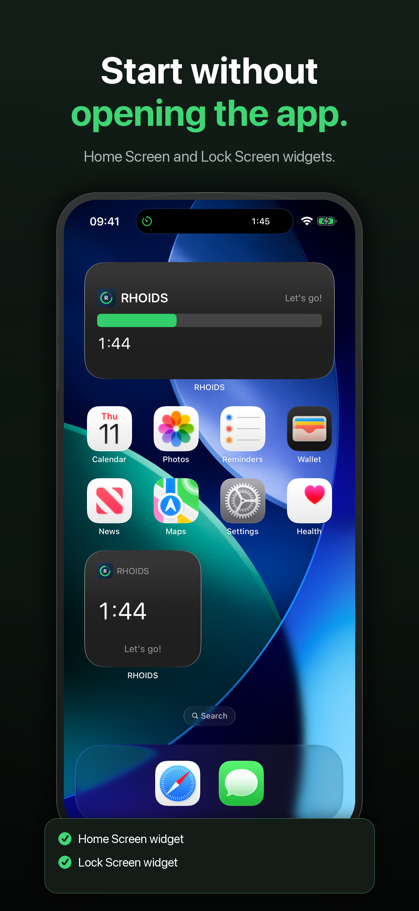
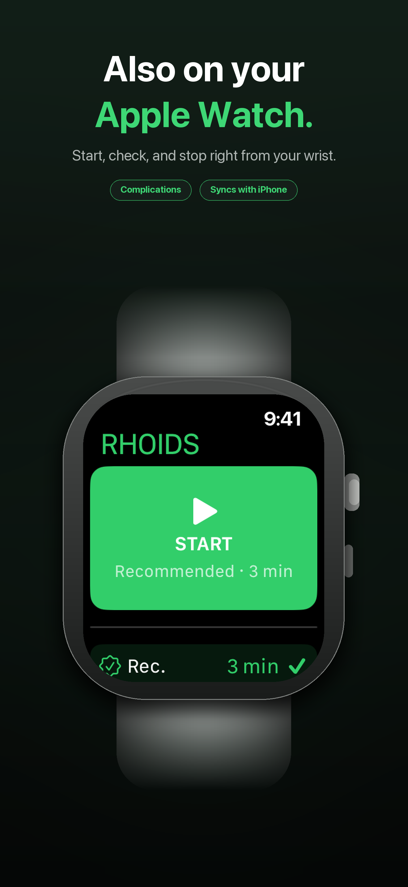
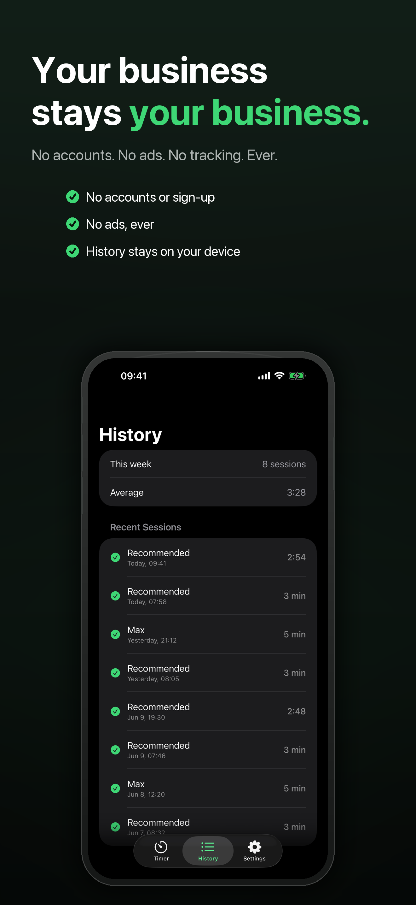

# RHOIDS

RHOIDS is a focused bathroom timer for iPhone and Apple Watch. It helps people keep toilet sessions short with research-informed presets, persistent system surfaces, optional distraction blocking, and private on-device history. It does one slightly awkward job, takes that job seriously, and tries to make the experience feel friendly instead of clinical.

## Why This App Exists

Phones make it very easy to turn a quick bathroom break into a long scrolling session. A [2025 PLOS One study](https://doi.org/10.1371/journal.pone.0329983) found an association between smartphone use on the toilet and a 46 percent higher risk of hemorrhoids among surveyed adults undergoing screening colonoscopy. RHOIDS turns that research into one practical habit: start a short timer, put the phone down, and get on with your day.

RHOIDS is a behavior timer, not a medical device or medical advice. Persistent pain, bleeding, or other symptoms belong in a conversation with a qualified healthcare professional.

## Platforms

- iPhone on iOS 26.4 or later
- Apple Watch on watchOS 11.5 or later
- iPhone Home Screen and Lock Screen widgets
- Live Activities and Dynamic Island
- Apple Watch complications
- Screen Time extensions for the optional Focus Lock feature

## Highlights

- Three-minute, five-minute, and custom timers
- Six timer visualizations with optional 30-second warnings
- AlarmKit completion alarms and local notifications
- Lock Screen, Dynamic Island, widget, Siri, and Apple Watch controls
- Optional Focus Lock for selected distracting apps
- Local session history and daily streaks
- StoreKit 2 tip jar
- 12 non-English localizations
- No accounts, advertising, analytics, or third-party dependencies

## Screenshots

These images are generated from genuine app and simulator captures. The surrounding device frames and captions are marketing artwork; the UI itself is not fabricated.

| iPhone | Focus Lock | Live Activity |
|---|---|---|
|  |  |  |

| Widgets | Apple Watch | Private history |
|---|---|---|
|  |  |  |

Genuine Apple Watch captures are in [`AppStore/Screenshots/masters-1320x2868/Watch`](AppStore/Screenshots/masters-1320x2868/Watch). Raw captures, App Store upload copies, review correspondence, and campaign-production files are intentionally kept out of the public repository.

## Project Layout

```text
Sources/
  RHOIDS/                    iPhone app
  RHOIDSWidget/              widgets and Live Activity
  RHOIDSWatch/               Apple Watch app
  RHOIDSWatchWidget/         watch complications
  RHOIDSDeviceActivityMonitor/
  RHOIDSShieldAction/        Screen Time extensions
  RHOIDSShieldConfiguration/
  Shared/                    cross-target models and services
  Connectivity/              phone/watch messages and preferences
Tests/
  RHOIDSTests/               iPhone and shared tests
  RHOIDSWatchTests/          watch app and complication tests
AppStore/                    listing copy and screenshots
qa/                          manual and release validation guides
scripts/                     project and verification tooling
project.yml                  XcodeGen source of truth
```

## Requirements

- macOS with Xcode 26 or later
- XcodeGen 2.45.4 when regenerating the project
- An Apple Developer team for signed-device testing
- Family Controls entitlement approval for Focus Lock on physical devices

## Build

`project.yml` is the durable project definition. Regenerate the checked-in Xcode project after changing targets, build settings, source membership, or versioning:

```bash
xcodegen generate
open RHOIDS.xcodeproj
```

Select the `RHOIDS` scheme and an iPhone simulator. The included `RHOIDS.storekit` file provides local StoreKit products.

### Configure a fork

The checked-in project keeps the identifiers used by the shipping app. Before signing a fork:

1. Change `DEVELOPMENT_TEAM` and `bundleIdPrefix` in `project.yml`.
2. Replace each `PRODUCT_BUNDLE_IDENTIFIER` in `project.yml` with identifiers owned by your team.
3. Replace `group.com.wesley.RHOIDS` in every entitlement file and in `Sources/Shared/SharedStateKeys.swift` with an App Group owned by your team.
4. Run `xcodegen generate` and review the generated project diff.
5. Select your team in Xcode and confirm that every app and extension target signs.

Focus Lock requires Apple-granted Family Controls capabilities and cannot be fully validated in an unsigned simulator build. AlarmKit, notification delivery, Live Activities, and Watch connectivity also require physical-device checks before release claims are appropriate.

## Tests

Run the iPhone suite:

```bash
xcodebuild test \
  -project RHOIDS.xcodeproj \
  -scheme RHOIDS \
  -destination 'platform=iOS Simulator,name=iPhone 17 Pro'
```

Run the watch suite with an available Apple Watch simulator:

```bash
xcodebuild test \
  -project RHOIDS.xcodeproj \
  -scheme RHOIDSWatchTests \
  -destination 'platform=watchOS Simulator,name=Apple Watch Series 11 (46mm)'
```

Simulator tests do not prove AlarmKit presentation, Screen Time authorization and shielding, notification delivery, watch-to-phone behavior, signing, TestFlight, or App Store acceptance. The release checks in [`qa/`](qa) keep those gates explicit.

## Privacy

RHOIDS has no account system, advertising, analytics, or tracking. Timer preferences and session history remain on device; Apple system services are used for notifications, Screen Time, Live Activities, widgets, watch connectivity, and optional StoreKit purchases. See [PRIVACY.md](PRIVACY.md).

## Contributing and Security

See [CONTRIBUTING.md](CONTRIBUTING.md) before proposing changes. Please report security or privacy concerns privately as described in [SECURITY.md](SECURITY.md).

## License

The source code is available under the [MIT License](LICENSE). The RHOIDS name, app icon, screenshots, and App Store marketing artwork are not granted for use as the identity of a redistributed app. Forks should use their own product name and artwork.
